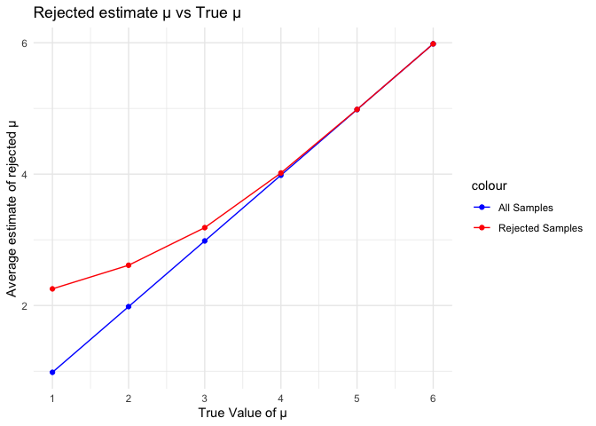

Homework 5
================
Hanchuan Chen
2024-11-09

``` r
library(tidyverse)
```

### Problem 2

``` r
# t test for mu=0
n = 30
mu = 0
sigma = 5
alpha = 0.05

results = data.frame(mu_hat = numeric(5000), p_value = numeric(5000))

set.seed(42)
for (i in 1:5000) {
  data = rnorm(n=30, mean = mu, sd = sigma)
  t_test = t.test(data, mu=0)
  
  tidy_test = broom::tidy(t_test)
  results$mu_hat[i] = tidy_test$estimate
  results$p_value[i] = tidy_test$p.value
}
```

``` r
# repeat test for mu = 1 to 6
n = 30
sigma = 5
alpha = 0.05

results <- data.frame(mu = numeric(), mu_hat = numeric(), p_value = numeric())

set.seed(42)
for (j in 1:6) {
  mu = j
  sub_results = data.frame(mu = j, mu_hat = numeric(5000), p_value = numeric(5000))
  
  for (i in 1:5000) {
    data = rnorm(n=30, mean = mu, sd = sigma)
    t_test = t.test(data, mu=0)
    
    tidy_test = broom::tidy(t_test)
    sub_results$mu_hat[i] = tidy_test$estimate
    sub_results$p_value[i] = tidy_test$p.value
  }
  
  results = bind_rows(results, sub_results)
}
```

``` r
#plot the first plot
rejected_p_value = 
  results |> 
  filter(p_value < 0.05) |> 
  group_by(mu) |> 
  summarize(count = n()) |> 
  mutate(prop = count / 5000)

ggplot(rejected_p_value, aes(x = mu, y = prop)) +
  geom_line() +
  geom_point() +
  scale_x_continuous(breaks = 1:6) +
  labs(x = "True Value of μ", y = "Proportion of Rejections", 
       title = "Power of the Test vs True μ") +
  theme_minimal()
```

<!-- -->

From the plot above, it is clear to see that As the true μ gets larger
(moving from 1 to 6), the effect size increases, making it easier to
reject the null hypothesis with higher power.

``` r
# plot the second plot
avg_all_estimate = 
  results |> 
  group_by(mu) |> 
  summarize(mean_mu_all = mean(mu_hat))

avg_rejected_estimate = 
  results |> 
  filter(p_value < 0.05) |> 
  group_by(mu) |> 
  summarize(mean_mu_rejected = mean(mu_hat))

avg_estimate = inner_join(avg_all_estimate, avg_rejected_estimate, by = "mu")

ggplot(avg_estimate, aes(x = mu)) +
  geom_line(aes(y=mean_mu_all, color = "All Samples")) +
  geom_point(aes(y=mean_mu_all, color = "All Samples")) +
  geom_line(aes(y=mean_mu_rejected, color = "Rejected Samples")) +
  geom_point(aes(y=mean_mu_rejected, color = "Rejected Samples")) +
  scale_x_continuous(breaks = 1:6) +
  labs(x = "True Value of μ", y = "Average estimate of rejected μ", 
       title = "Rejected estimate μ vs True μ") +
  scale_color_manual(values = c("All Samples" = "blue", "Rejected Samples" = "red")) +
  theme_minimal()
```

<!-- -->

In this plot, blue line represents the average estimate of mean and red
line represents the average estimate of mean only in rejected samples.
For the tests with true value of μ are 1,2, and 3, the sample average of
μ across tests for which the null is rejected is greater than true μ;
however, they are approximately equal to true μ when the value is 4,5,
and 6.

This is because we are selecting cases where is likely farther from zero
when we only pick rejected samples. This effect causes the average among
rejected samples to be larger than the true μ, particularly for smaller
true values.

### Problem 3

``` r
homicide_df = 
  read_csv("./data/homicide-data.csv") |> 
  janitor::clean_names() |> 
  mutate(city_state = paste(city, state, sep=", ")) 

homicide_count = 
  homicide_df |> 
  group_by(city, disposition) |> 
  summarize(count = n()) |> 
  pivot_wider(
    names_from = disposition,
    values_from = count
  ) |> 
  janitor::clean_names() |> 
  mutate(total = closed_by_arrest + coalesce(closed_without_arrest,0) + open_no_arrest) |> 
  mutate(unsolved = coalesce(closed_without_arrest,0) + open_no_arrest) |> 
  select(city, total, unsolved)
```

For the raw homicide data, it contains specific date, basic information
of victims, and the location of homicide, finally with the disposition
of the issue in 50 cities in U.S.. There are 52179 of issues and 13 of
variables.

``` r
baltimore_data = 
  homicide_count |> 
  filter(city == "Baltimore")

prop_test = prop.test(baltimore_data$unsolved, baltimore_data$total)
tidy_test = broom::tidy(prop_test)
cat("estimate proportion:", tidy_test$estimate)
```

    ## estimate proportion: 0.6455607

``` r
cat("confidence interval:", tidy_test$conf.low, tidy_test$conf.high)
```

    ## confidence interval: 0.6275625 0.6631599

The estimated proportion of unsolved homicide cases in Baltimore, MD, is
approximately 64.6%. The 95% confidence interval for this estimate
ranges from about 62.8% to 66.3%.

Below dataframe is the estimate and confidence interval for all cities,
including total number of homicides and unsolved number of homicides:

``` r
calculate_prop = function(unsolved, total) {
  prop_test = prop.test(unsolved, total)
  tidy_test = broom::tidy(prop_test)
  
  list(
    estimated_proportion = tidy_test$estimate,
    conf_low = tidy_test$conf.low,
    conf_high = tidy_test$conf.high
  )
}

city_proportions = 
  homicide_count |> 
  mutate(results = map2(unsolved, total, calculate_prop)) |> 
  unnest_wider(results)

knitr::kable(city_proportions, digits = 3)
```

| city           | total | unsolved | estimated_proportion | conf_low | conf_high |
|:---------------|------:|---------:|---------------------:|---------:|----------:|
| Albuquerque    |   378 |      146 |                0.386 |    0.337 |     0.438 |
| Atlanta        |   973 |      373 |                0.383 |    0.353 |     0.415 |
| Baltimore      |  2827 |     1825 |                0.646 |    0.628 |     0.663 |
| Baton Rouge    |   424 |      196 |                0.462 |    0.414 |     0.511 |
| Birmingham     |   800 |      347 |                0.434 |    0.399 |     0.469 |
| Boston         |   614 |      310 |                0.505 |    0.465 |     0.545 |
| Buffalo        |   521 |      319 |                0.612 |    0.569 |     0.654 |
| Charlotte      |   687 |      206 |                0.300 |    0.266 |     0.336 |
| Chicago        |  5535 |     4073 |                0.736 |    0.724 |     0.747 |
| Cincinnati     |   694 |      309 |                0.445 |    0.408 |     0.483 |
| Columbus       |  1084 |      575 |                0.530 |    0.500 |     0.560 |
| Dallas         |  1567 |      754 |                0.481 |    0.456 |     0.506 |
| Denver         |   312 |      169 |                0.542 |    0.485 |     0.598 |
| Detroit        |  2519 |     1482 |                0.588 |    0.569 |     0.608 |
| Durham         |   276 |      101 |                0.366 |    0.310 |     0.426 |
| Fort Worth     |   549 |      255 |                0.464 |    0.422 |     0.507 |
| Fresno         |   487 |      169 |                0.347 |    0.305 |     0.391 |
| Houston        |  2942 |     1493 |                0.507 |    0.489 |     0.526 |
| Indianapolis   |  1322 |      594 |                0.449 |    0.422 |     0.477 |
| Jacksonville   |  1168 |      597 |                0.511 |    0.482 |     0.540 |
| Kansas City    |  1190 |      486 |                0.408 |    0.380 |     0.437 |
| Las Vegas      |  1381 |      572 |                0.414 |    0.388 |     0.441 |
| Long Beach     |   378 |      156 |                0.413 |    0.363 |     0.464 |
| Los Angeles    |  2257 |     1106 |                0.490 |    0.469 |     0.511 |
| Louisville     |   576 |      261 |                0.453 |    0.412 |     0.495 |
| Memphis        |  1514 |      483 |                0.319 |    0.296 |     0.343 |
| Miami          |   744 |      450 |                0.605 |    0.569 |     0.640 |
| Milwaukee      |  1115 |      403 |                0.361 |    0.333 |     0.391 |
| Minneapolis    |   366 |      187 |                0.511 |    0.459 |     0.563 |
| Nashville      |   767 |      278 |                0.362 |    0.329 |     0.398 |
| New Orleans    |  1434 |      930 |                0.649 |    0.623 |     0.673 |
| New York       |   627 |      243 |                0.388 |    0.349 |     0.427 |
| Oakland        |   947 |      508 |                0.536 |    0.504 |     0.569 |
| Oklahoma City  |   672 |      326 |                0.485 |    0.447 |     0.524 |
| Omaha          |   409 |      169 |                0.413 |    0.365 |     0.463 |
| Philadelphia   |  3037 |     1360 |                0.448 |    0.430 |     0.466 |
| Phoenix        |   914 |      504 |                0.551 |    0.518 |     0.584 |
| Pittsburgh     |   631 |      337 |                0.534 |    0.494 |     0.573 |
| Richmond       |   429 |      113 |                0.263 |    0.223 |     0.308 |
| Sacramento     |   376 |      139 |                0.370 |    0.321 |     0.421 |
| San Antonio    |   833 |      357 |                0.429 |    0.395 |     0.463 |
| San Bernardino |   275 |      170 |                0.618 |    0.558 |     0.675 |
| San Diego      |   461 |      175 |                0.380 |    0.335 |     0.426 |
| San Francisco  |   663 |      336 |                0.507 |    0.468 |     0.545 |
| Savannah       |   246 |      115 |                0.467 |    0.404 |     0.532 |
| St. Louis      |  1677 |      905 |                0.540 |    0.515 |     0.564 |
| Stockton       |   444 |      266 |                0.599 |    0.552 |     0.645 |
| Tampa          |   208 |       95 |                0.457 |    0.388 |     0.527 |
| Tulsa          |   584 |      193 |                0.330 |    0.293 |     0.371 |
| Washington     |  1345 |      589 |                0.438 |    0.411 |     0.465 |

Below is the plot showing the confidence interval of proportion of
homicide in each city:

``` r
city_proportions =
  city_proportions |> 
  arrange(desc(estimated_proportion))

city_proportions$city = 
  factor(city_proportions$city, levels = city_proportions$city)

# Plot the estimates and confidence intervals
ggplot(city_proportions, aes(x = city, y = estimated_proportion)) +
  geom_point() +
  geom_errorbar(aes(ymin = conf_low, ymax = conf_high), width = 0.2) +
  coord_flip() + 
  labs(
    title = "Proportion of Unsolved Homicides by City with Confidence Intervals",
    x = "City",
    y = "Estimated Proportion of Unsolved Homicides"
  ) +
  theme_minimal()
```

<!-- -->
